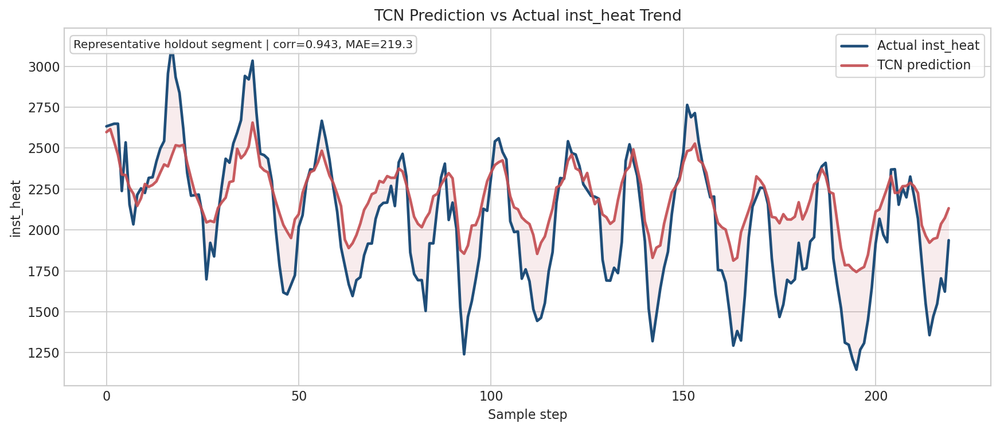

# Appliance Energy Forecasting with RAG and LLM

An anonymized industrial appliance time-series project that forecasts short-horizon power/heat demand, detects abnormal forecast residuals, retrieves operational context with RAG, and generates engineer-facing answers with an OpenAI GPT model.

Raw data, API keys, trained model binaries, and proprietary identifiers are intentionally excluded from this public repository.

## Overview

This project demonstrates an end-to-end workflow for operational energy analytics:

- Forecast short-horizon `inst_heat` demand from appliance sensor features
- Use forecast residuals to flag abnormal operating windows
- Interpret residuals separately for gas-like and heating-like operating modes
- Estimate relative operating cost from the summed short-horizon forecast
- Retrieve supporting context from synthetic operator manuals and incident summaries
- Generate concise operator-facing answers with an LLM API

The main model is a Temporal Convolutional Network (TCN). The RAG layer uses a local TF-IDF retriever wrapped by LangChain/LangGraph, and the saved demo answers were generated with `gpt-5.4-mini`.

## Table of Contents

- [Overview](#overview)
- [Key Results](#key-results)
- [Example Questions and Answers](#example-questions-and-answers)
- [Repository Layout](#repository-layout)
- [Requirements](#requirements)
- [Installation](#installation)
- [Run the LLM Answer Workflow](#run-the-llm-answer-workflow)
- [Notes](#notes)

## Key Results

Forecast target: `inst_heat`

Model: Temporal Convolutional Network (TCN)

Best historical TCN checkpoint experiment:

| model | input length | output length | features | energy-area rel. error |
| --- | ---: | ---: | ---: | ---: |
| TCN | 10 | 10 | 22 | 0.0069 |

The point-wise MAPE in this dataset is unstable because the target can be near zero. For that reason, the project emphasizes energy-area and aggregate-window errors for operational interpretation.

### Prediction Trend Example

The plot below shows a representative holdout segment from the TCN prediction artifact. It compares actual `inst_heat` against the model prediction over the same sample range.



Additional artifacts:

- [Forecast summary](outputs/reports/facility_a_inst_heat_multioutput_summary.md)
- [Best TCN experiment note](docs/knowledge/best_tcn_experiment_summary.md)
- [Gas-like RAG context](outputs/reports/facility_a_gas_like_rag_context.md)
- [Heating-like RAG context](outputs/reports/facility_a_heating_like_rag_context.md)
- [API answer run summary](outputs/rag/dummy_engineer_api_runs/20260625_150159/summary.md)
- RAG manual corpus: 10 synthetic operator, diagnostic, sensor, mode, and alarm documents

## Example Questions and Answers

The examples below are shortened from generated LLM answer records. Each answer cites retrieved context chunks in the full artifact.

### 1. Cost increase with lower heat forecast

**Question**

> The short-horizon `inst_heat` forecast is lower than expected, but the operating cost estimate is rising. What should I inspect first?

**Answer summary**

The model should compare the short-horizon forecast sum with the operating-cost estimate before treating low heat as abnormal. In gas-like mode, low or zero `inst_heat` is not automatically anomalous. The first inspection targets are `3way_DHW`, `hotwater_th`, `inv1_input_current`, and compressor current/target frequency trends.

Full answer: [gas_cost_rise_01_answer.md](outputs/rag/dummy_engineer_api_runs/20260625_150159/gas_cost_rise_01_answer.md)

### 2. Near-zero heat in gas-like mode

**Question**

> In gas mode, `inst_heat` is almost zero. Can this be normal, and where should I check first?

**Answer summary**

Near-zero `inst_heat` can be normal in gas-like mode, so the answer first checks whether `opermode=1` is consistent with the expected operating state. Because the residual window is still large, the recommended next checks are mode consistency, `3way_DHW`, `hotwater_th`, inverter input current, compressor current frequency, and target frequency.

Full answer: [gas_zero_heat_02_answer.md](outputs/rag/dummy_engineer_api_runs/20260625_150159/gas_zero_heat_02_answer.md)

### 3. Heating-mode drift with repeated alarm pattern

**Question**

> In heating mode, the forecast is drifting and alarm patterns repeat. Which manual section and field checks should I inspect first?

**Answer summary**

For heating-like mode, the answer prioritizes compressor load/current, target frequency, pressure stability, and temperature variation. The incident evidence points to a large short-horizon residual and feature shifts around `vi_eev1`, inverter input current, compressor current frequency, and target frequency, so the first field checks focus on EEV/valve behavior and compressor frequency tracking.

Full answer: [heat_alarm_code_06_answer.md](outputs/rag/dummy_engineer_api_runs/20260625_150159/heat_alarm_code_06_answer.md)

## Repository Layout

```text
docs/
  manuals/                  Synthetic but realistic operator manuals used by RAG
                            Includes sensor, compressor, valve, mode, alarm, cost, and inspection guides
  knowledge/                Mode-awareness and operating notes
  portfolio_demo_questions.md

outputs/
  reports/                  Public forecast and RAG context summaries
  rag/                      Saved LLM answer examples

scripts/
  00_scan_energy_data.py
  01_prune_energy_features.py
  18_build_facility_a_mode_contexts.py
  19_build_facility_a_mode_rag_corpus.py
  20_build_facility_a_mode_tfidf_index.py
  24_generate_dummy_engineer_prompt_suite.py
  25_train_facility_a_inst_heat_tcn.py
  26_run_dummy_engineer_openai_api.py

src/power_forecast_rag/
  rag.py                    TF-IDF index loading and search helpers
  mode_langchain_rag.py     LangChain retriever and prompt formatting
  mode_langgraph_workflow.py
```

## Requirements

Python 3.10+ is recommended.

Core Python packages:

- `pandas`
- `numpy`
- `scikit-learn`
- `scipy`
- `joblib`
- `matplotlib`
- `langchain-core`
- `langgraph`
- `pydantic`
- `openai`
- `torch`

The full package list is in [requirements.txt](requirements.txt).

## Installation

Clone the repository:

```bash
git clone https://github.com/qowhdgus1205/appliance-energy-forecasting-rag-llm.git
cd appliance-energy-forecasting-rag-llm
```

Create and activate a virtual environment:

```bash
python -m venv .venv
source .venv/bin/activate
```

Install dependencies:

```bash
pip install -r requirements.txt
```

Optional local package path for scripts:

```bash
export PYTHONPATH="$PWD/src:$PYTHONPATH"
```

Raw data and trained model binaries are not included. The repository is designed to show the anonymized workflow, public summaries, prompt artifacts, and generated LLM answer examples.

The included TCN training script is a reproducible public demo. The best historical checkpoint metrics reported above come from a private local experiment whose raw data and binary checkpoints are intentionally excluded.

## Run the LLM Answer Workflow

Set an OpenAI API key through the environment:

```bash
export OPENAI_API_KEY="your-openai-api-key"
```

Run all prepared engineer questions:

```bash
python scripts/26_run_dummy_engineer_openai_api.py --model gpt-5.4-mini
```

Run one question only:

```bash
python scripts/26_run_dummy_engineer_openai_api.py --question-id gas_cost_rise_01
```

The script writes markdown answers and JSON traces into:

```text
outputs/rag/dummy_engineer_api_runs/<timestamp>/
```

## Notes

- The included manuals are synthetic and used only to demonstrate retrieval-grounded answering.
- The cost comparison uses assumed rates, not real billing data.
- Facility names and paths have been anonymized.
- Raw datasets, model binaries, and API keys are excluded by design.
